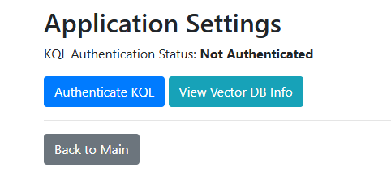
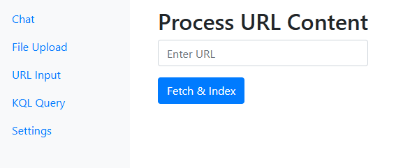

# KqlNexus  

Welcome to the official repository for **KqlNexus**! This tool is designed for security researchers and data analysts who work with KQL (Kusto Query Language), URLs, and other files as part of their daily tasks. KqlNexus combines the power of Retrieval-Augmented Generation (RAG) with KQL query execution and data analysis, enabling you to interact with KQL/Kusto outputs seamlessly.  

## Features  

- **KQL Query Execution**: Run KQL queries directly within the tool for efficient data exploration.  
- **Data Analysis**: Analyze query results to gain actionable insights.  
- **RAG Integration**: Leverage Retrieval-Augmented Generation to enhance to understand the data from URL and File parsing.
- **Interactive Chat**: Chat with KQL/Kusto outputs for a more intuitive experience.  

## Installation  

To get started with KqlNexus, follow these steps:  

1. Clone the repository:  
    ```bash  
    git clone https://github.com/4R9UN/KqlNexus.git  
    ```  

2. Navigate to the directory:  
    ```bash  
    cd KqlNexus  
    ```  

3. Run the Jupyter Notebook:  
    ```bash  
    jupyter notebook KqlNexus.ipynb  
    ```  

## Usage  

Here's how you can use KqlNexus for your daily tasks:  

1. **Run a KQL Query**:  
    Once you load the notebook, the local server starts at `http://127.0.0.1:5000/`. Navigate to the **Settings** tab, authenticate with your Azure tenant, and enter your KQL query. It is recommended to start with a small query for testing purposes.  

2. **Data Vectorize and indexing Data**:  
    Use the built-in functionality for data indexing and vectorizing. Click the "Generate Vector DB" button, which will create a vector file. Once generated, you can interact with the datasets through the chat interface for further analysis.  

3. **Chat with Outputs**:  
    Interact with the query results using the chat interface for deeper insights.





## Configuration  

- **Load LM model**: Specify the endpoint for your KQL queries.  

## Contributing  

We welcome contributions from the community! To contribute:  

1. Fork the repository.  
2. Create a new branch:  
    ```bash  
    git checkout -b feature-name  
    ```  
3. Make your changes.  
4. Submit a pull request.  


## Contact  

For questions or support, reach out to us at [arjuntrivedi42@yahoo.com] or open an issue on GitHub.  
